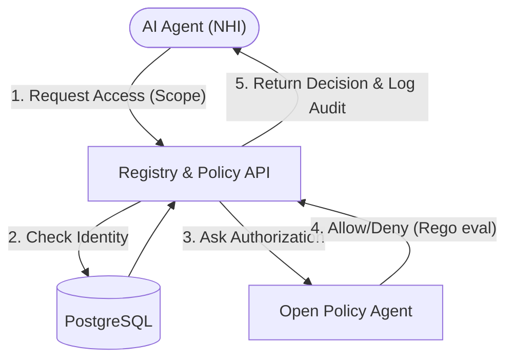

# Architecture — nhi-agent-access-governance
> Last updated: 2026-08-29 | Maturity: Partial Prototype
> _NHI access governance platform with OPA._

## System Diagram
The following Mermaid.js sequence diagram maps the core workflow and interactions:

## Component Table

| Component | File | Responsibility | Tech |
|---|---|---|---|
| Registry API | `registry-api/` | Main entrypoint | Node.js |
| Policy Engine | `policy/` | Authz rules | Rego / OPA |
| Database | `docker-compose.yml` | Identity store & Audit log | PostgreSQL |
| Dashboard | `dashboard/` | UI for analysts | React |

## Dependency Honesty Table

| Dependency | Status | Notes |
|---|---|---|
| OPA | **Real** | Used as the live Policy Decision Point. |
| PostgreSQL | **Real** | Used for identities and audit logs. |
| Target System | **Simulated** | API intercepts requests but doesn't forward to a real Kubernetes cluster. |

## The NHI Lifecycle Model

This project demonstrates a zero-trust model for managing NHIs.

### 1. Registration & Scoping
Every AI Agent, bot, or service account must be registered in the **NHI Registry**. 
- It is assigned an **Owner** (for accountability).
- It is granted specific, least-privilege **Scopes** (e.g., `read:kubernetes_pods`, not `*:*`).
- It has a definitive **Expiry** (to prevent credential hoarding/drift).

### 2. Request & Policy Evaluation
When an AI agent requests an action (e.g., reading a database, or fetching kubernetes secrets):
- The agent authenticates (using short-lived OIDC or mTLS credentials).
- The registry API acts as a Policy Enforcement Point (PEP).
- It queries the **Policy Engine (Open Policy Agent - OPA)**, passing the agent's assigned scopes and the requested action/resource.
- OPA evaluates the request against the declarative Rego policies (Policy Decision Point).

### 3. Auditing & Logging
Every decision (Allowed or Denied) is recorded in an immutable **Audit Log**. 
- If an agent is compromised and attempts to escalate privileges (e.g., a supply-chain attack trying to read Kubernetes secrets instead of pods), the request is dropped.
- The denial is instantly logged with the specific reason and the agent's ID.

## Why OPA?
By decoupling the policy logic (Rego) from the API code (Node.js), we allow security teams to update access rules dynamically without redeploying the application, fulfilling the "Policy-as-Code" mandate of modern DevSecOps.